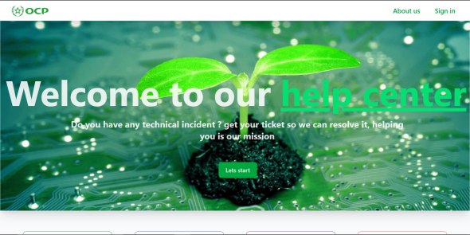

<h1 align="center" style="font-size: 5em;" >Incident management project</h1>

# Introduction
This project was developed during my internship as a real-world solution for managing technical incidents in an organization. The system is designed to optimize how incidents are reported, tracked, and resolved — helping technical teams improve response time and efficiency.

# About the project
The Incident Management System is a full-stack web application built with React, Node.js, Express, and PostgreSQL, using Vite for fast frontend development. It provides a centralized platform for administrators and technicians to manage technical incidents. Key features include user management, incident tracking, role-based access control, and PDF export of reports. The system is designed to be intuitive, secure, and scalable.

# Table of content
- [Software design](#software-design)
- [Project execution](#project-execution)

# Software design

## Use case diagram
<div align="center" style="background-color: white">
  
</div>

## Sequence diagram
### For an administrator
<div align="center">
  
</div>

### For a technician
<div align="center">
  
</div>

### For a user
<div align="center">
  
</div>

## Activity diagram
<div align="center">
  
</div>

# Project execution

## Terminal commands

After poling the project in you local machine you should have a postgraSQL database with the port 8000, you can change the port from the "server/src/config/database.mjs" in this part:
```
4 const client = new Client({
5   host: 'localhost',
6   port: 8000,  // <-- change the port from 8000 to you port (default port is 5432)
7   user: 'postgres',
8   password: 'a2y0',
9   database: 'db_intervention_management'
10 });
```
After that, open two terminal, one for the frontend and the other for the backend, in the first terminal use these commands after being incide the project.
```
cd client
npm install
npm run dev
```
in the secound terminal run these commands.
```
cd server
npm install 
npm run dev
```
In the backend side make sure that you have these messages to make sure that evrything is runing correctly:

```
🚀 Server running on port 5000
📡 API available at http://localhost:5000
📊 PostgreSQL Connected
📊 PostgreSQL Connected
```
## Terminal commands
After runing the necessary commands, run the application by opening you browser and puting on the url the frontend port: http://localhost:5173/ to see the first page:

<div align="center">
  
</div>

You can Log in if you have an account, or click on the let's start button to enter to the sign up page:

<div align="center">
  
</div>

After that you can log in with your account:

<div align="center">
  
</div>

And welcome to the user side.

## User side
### Dashboard
You have a big dashboard with some statistics that belong to you.
<div align="center">
  
</div>

### My tickets
There where you can manage you tickets, add a new one, update it's data, export the tickets in the PDF format, export the list of tickets into the PDF format, and also search for the ticket that you want using the top bar:
<div align="center">
  
</div>
<div align="center">
  
</div>
<div align="center">
  
</div>
<div align="center">
  
</div>
<div align="center">
  
</div>

### My profile
This page is you profile when you can see and update your data, and also log out from you account.
<div align="center">
  
</div><div align="center">
  
</div><div align="center">
  
</div>

## Technician side
If you wanna connect as a technician, your account should be added from your administrator, so you don't have so sign up because of your role, there is a data to connect with if you wanna test your app:
```
aymen@gmail.com
test1234  <-- you can't see the password from the database because it's hashed
```
The technician has the same pages , the only thing that changed is that he can't add a new ticket and he can change the status, and add a comment about the ticket.

### Ticket management
<div align="center">
  
</div>
<div align="center">
  
</div><div align="center">
  
</div>

## Administrator side
If you wanna connect as an Administrator, your account should be added from another administrator, so you don't have so sign up because of your role, there is a data to connect with if you wanna test your app:
```
ahmed@gmail.com
test1234  <-- you can't see the password from the database because it's hashed
```
The technician has the same pages + users management when he can add a user and change his role, also he can ban the user if he want , about the tickets page he can also see the comment, assign the tickets to a technician, close the tickets if it's resolved, and change it's prioity.

### Users management
<div align="center">
  
</div>
<div align="center">
  
</div><div align="center">
  
</div>

### Tickets management
<div align="center">
  
</div>
<div align="center">
  
</div><div align="center">
  
</div>
